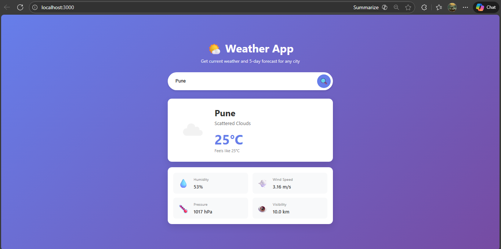

# **Weather Search App** 

A simple weather application that allows users to search for current weather information by city name.

## **About**

This application fetches real-time weather data from OpenWeatherMap API and displays temperature, humidity, wind speed, pressure, and visibility information. The backend implements caching to improve performance for repeated queries.

## **Result**



### **Tech Stack**

#### **Backend**
- Java (Core Java with HttpServer)
- Gson library for JSON parsing
- OpenWeatherMap API

#### **Frontend**
- React
- CSS for styling
- Fetch API for backend communication

### **Prerequisites**
- Java JDK 11 or higher
- Node.js and npm
- OpenWeatherMap API key (free account at https://openweathermap.org)

### **Setup**

#### 1.Get API key
- Sign up at https://openweathermap.org
- Get your free API key
- Create config.properties file at root level of project and create env variable for your api key like this
  ```bash
  api_key=OPENWEATHERMAP_API_KEY
  api.url=https://api.openweathermap.org/data/2.5/weather
  cache.expiry.minutes=10
  cache.max.entries=100
  ```
- Add it to config.properties

```bash 
api.key=YOUR_API_KEY_HERE
```
#### 2.Install Frontend Dependencies
```bash
cd frontend
npm install
```

### **Running the Application**
#### Backend (Port 8080)

```bash
cd weather-search-app
java -cp "out/production/weather-search-app;lib/*" com.weather.WeatherServer
```

#### Frontend (Port 3000)
```bash
cd frontend
npm start
```


